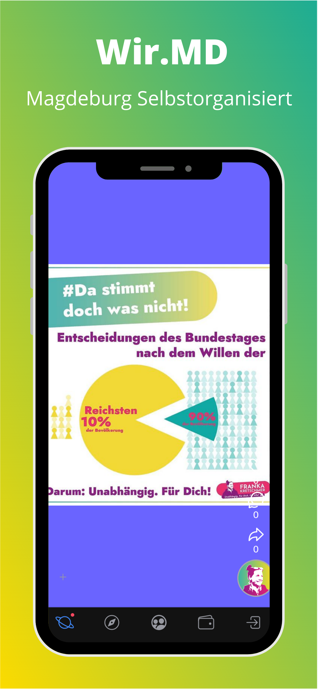
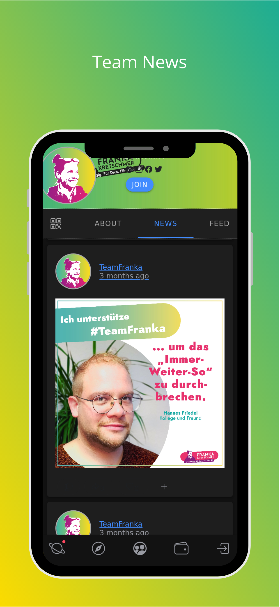
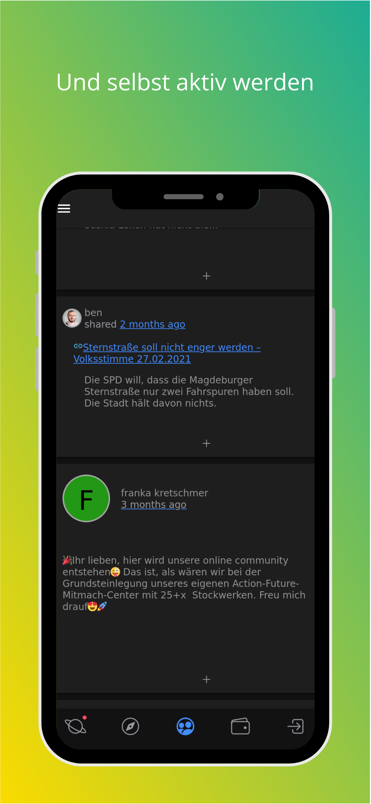

# Affinity

The affinity progressive communities network app is a social network for progressive movements and initiatives and their followers.

## Distribution

We are currently automatically deploying the [Wir.md App](https://app.wir.md/) to Parse, the [Google Play Store](https://play.google.com/store/apps/details?id=md.wir.app&hl=de_DES&gl=de) and the [Apple AppStore](https://apps.apple.com/us/app/wir-md-by-teamfranka/id1567204902)

## Development

See [docs.affinity.wtf](https://docs.affinity.wtf) for Developer Docs.

## Contributing

See [the Contributions Guide](./docs/CONTRIBUTING.md). Tl;dr:

1. Raise an atomic PR with your changes - one fix/feature per PR
   Please add tests whenever possible!
2. Sign the CLA
3. All Tests/CI checks must pass
4. Review crumbles must be addressed.

## License

This code is licensed under the Affinity Code License (see LICENSE.txt), based on the Business Code License, which is an _eventually Open Source License_, meaning the code is available under the GNU AFFERO GENERAL PUBLIC LICENSE 3.0 (see LICENSE-AGPL.txt) two years after being published for the first time.

Before that time you are welcome to contribute to the code here - granted you allow the Affinity Council to reign over the copyright by [signing the Contributor License Agreement ("CLA") and follow the code of conduct](./.github/CONTRIBUTING.md). Further you are permitted to use this internally, for personal and educational purpose with up to a hundred registered users in a non-public-setting. For all other uses you need to acquire a separate license. To do so, please contact the Affinity Council.
